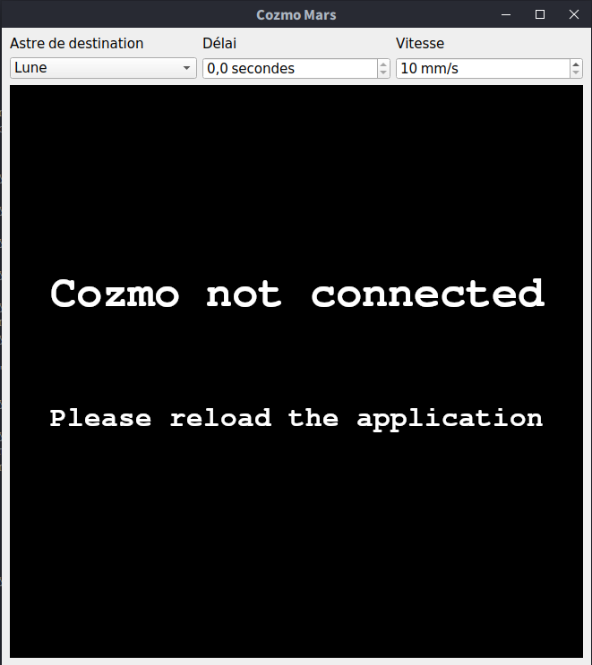

CozmoMars est une application écrite en python3 et PyQt5 qui utilise le SDK de [Cozmo Anki](https://ankicozmorobot.com/) pour contrôler à distance le robot avec un délai induit dans le but de simuler le pilotage de rover sur des surfaces du Système Solaire comme la Lune ou Mars.

# Installation

## Pré-requis

Pour pouvoir faire fonctionner cette application il vous faut les choses suivantes:

- un robot Anki Cozmo fonctionnel (et non Vector)
- Python 3.5 ou plus d'installé sur votre ordinateur
- un câble USB
- un smartphone Android ou iOS avec l'application [Cozmo Android](https://www.amazon.fr/Anki-Inc-Cozmo/dp/B01MA2WU55) ou [iOS](https://apps.apple.com/us/app/cozmo/id1154282030) d'installée dessus
- une connexion Wifi stable

## Modules nécessaires

Pour fonctionner le logiciel a besoin d'avoir installés les modules suivants

Module | Installation (Linux) | Utilité
:- | :- | :-
[PyQt5](https://www.riverbankcomputing.com/software/pyqt/) | pip install PyQt5 | Librarie graphique utilisée pour l'interface
[cozmo](http://cozmosdk.anki.com/docs/index.html) | pip3 install --user 'cozmo[camera]' | Kit de développement pour Cozmo

Pour les utilisateurs de Windows ou MacOS, vous pouvez retrouver des informations pour installer le SDK Cozmo à cette [addresse](http://cozmosdk.anki.com/docs/initial.html).

Si vous avez un téléphone Android, il faudra aussi installer l'Android Debug Bridge (ADB) en suivant le tuto à cette [addresse](http://cozmosdk.anki.com/docs/adb.html#adb).

# Utilisation

## Comment lancer l'application ?

Pour lancer l'application et connecter Cozmo au SDK, veuillez effectuer les étapes suivantes dans l'ordre:

1. Mettre Cozmo sur son socle de rechargement, lui-même connecté à une source de courant en USB. Une lumière verte devrait apparaître sur le dessus, ainsi que son réseau wifi.
2. Connecter votre réseau téléphone au réseau wifi de Cozmo en utilisant le code marqué sur son écran.
3. Connecter votre téléphone en USB à votre ordinateur. Si vous avez un téléphone Android, vérifiez que les modes developpeur et debugeur sont activés (icône P dans la barre de notification). Sinon, vérifiez qu'ils sont activés dans les paramètres puis débrancher et rebrancher.
4. Lancer l'application et connecter Cozmo en cliquant sur le bouton "Connecter". Cozmo devrait se réveiller et commencer à s'agiter.
5. Aller dans les paramètres en haut à droite et activer le mode SDK. Cozmo devrait se figer et ne plus réagir, mais rester activé.
6. Lancer l'application CozmoMars. Si réussi, l'application devrait apparaître avec la vision de Cozmo au centre.

## Interface et utilisation de Cozmo

L'interface est composée de deux lignes:

1. La première contient une liste déroulante qui permet de choisir des délais pré-définis pour la Lune, Mars et Vénus (à l'échelle), ainsi qu'un mode manuel. Seul le mode manuel permet de modifier le délai dans la zone de texte à droite. La zone de texte la plus à droite permet de changer la vitesse des roues de Cozmo.
2. La seconde contient l'image de la caméra de Cozmo

Les commandes suivantes sont disponibles pour contrôler Cozmo:

- flèches __haut__, __bas__, __gauche__, __droite__ pour déplacer le robot en avant, en arrière, à gauche et à droite
- touches __Z__ et __S__ pour monter et descendre la caméra
- touches __P__ et __M__ pour monter et descencre les bras

Après 10 secondes d'inactivité (facilement modifiable dans le code source via self.behaviourDelay dans cozmo_backend.py), Cozmo devient de nouveau autonome. Il suffit d'appuyer sur n'importe quelle touche citée plus haut pour reprendre le contrôle. Il est aussi possible de mettre en pause Cozmo, qui devient inactif aux touches, en cliquant sur l'image de la caméra. la bordure devient rouge et il ne répond plus. Un autre clique (la bordure devient verte) le réactive.

## FAQ

### Que faire si Cozmo ne répond plus ?

Si le robot ne répond plus, fermer et relancer l'application. Si l'image n'est plus visible, alors vérifier la connexion USB, débrancher puis rebrancher. Si toujours rien, vérifier que la connexion wifi est toujours bonne.

### Une des roues de Cozmo se bloque. Comment la débloquer ?

Si une roue se bloque, le plus simple est de temporairement monter la vitesse de Cozmo afin de débloquer la roue, puis de revenir à la valeur précédente.
